# Integrating your first screen

Firebase UI for Auth provides various Screens to handle different authentication flows throughout
your application, such as Sign In, Registration, Forgot Password, Profile etc.

To get started with, let's add an authentication flow to an application. In this scenario, users will
have to be authenticated in order to access the main application.

## Initializing Firebase

If you haven't already done so, you'll need to initialize Firebase before using FlutterFire UI.
You can learn more about this in the [Add Firebase to your Flutter app](https://firebase.google.com/docs/flutter/setup)
documentation, for example:

```dart title="lib/main.dart"
import 'package:flutter/material.dart';
import 'package:firebase_core/firebase_core.dart';
import 'firebase_options.dart';

Future<void> main() async {
  WidgetsFlutterBinding.ensureInitialized();
  await Firebase.initializeApp(
    options: DefaultFirebaseOptions.currentPlatform,
  );
  runApp(MyApp());
}
```

## Material or Cupertino App

FlutterFire UI requires that your application is wrapped in either a `MaterialApp` or `CupertinoApp`.
Depending on your choice, the UI will automatically reflect the differences of Material or Cupertino
widgets. For example, to use `MaterialApp`:

```dart title="lib/main.dart"
class MyApp extends StatelessWidget {
  const MyApp({Key? key}) : super(key: key);

  @override
  Widget build(BuildContext context) {
    return MaterialApp(
      home: AuthGate(),
    );
  }
}
```

The `AuthGate` widget will be implemented in the next step.

## Checking authentication state

Before we can display a sign in screen, we first need to determine whether the user is currently
authenticated. The most common way to check for this is to listen to authentication state changes
using the [Firebase Auth plugin](https://firebase.google.com/docs/auth/flutter/manage-users#get_a_users_profile).

The `authStateChanges` API returns a Stream with either the current user (if they are signed in), or
`null` if they are not. To subscribe to this state in our application, we can make use of the
[`StreamBuilder`](https://api.flutter.dev/flutter/widgets/StreamBuilder-class.html) widget and pass the stream to it.

In the previous step, the `AuthGate` widget is constructed from `MaterialApp`. This widget will require
that a user is signed in before accessing the main application.

```dart
import 'package:firebase_auth/firebase_auth.dart';

class AuthGate extends StatelessWidget {
  const AuthGate({Key? key}) : super(key: key);

  @override
  Widget build(BuildContext context) {
    return StreamBuilder<User?>(
      stream: FirebaseAuth.instance.authStateChanges(),
      builder: (context, snapshot) {
        // ...
      },
    );
  }
}
```

Our application starts by subscribing to the users authentication state, which is provided as the
`snapshot` to the Stream builder. To check whether the user is authenticated, the snapshot will contain
a `User` instance, or `null` if they are not. Using the snapshots [`hasData`](https://api.flutter.dev/flutter/widgets/AsyncSnapshot/hasData.html)
property we can conditionally display the sign in screen if no user is signed in:

```dart
return StreamBuilder<User?>(
  stream: FirebaseAuth.instance.authStateChanges(),
  builder: (context, snapshot) {
    // User is not signed in
    if (!snapshot.hasData) {
      // ...
    }

    // Render your application if authenticated
    return YourApplication();
  },
);
```

## Constructing a `SignInScreen` widget

FlutterFire UI for Auth provides different screens for different scenarios. For this example,
we are requiring that the user should be sign-in before accessing the main application. To do this,
we can return a [`SignInScreen`](https://pub.dev/documentation/flutterfire_ui/latest/auth/SignInScreen-class.html) widget.

Screens are customizable fully styled widgets designed to be rendered as a single "screen" within your application. Firstly,
import the FlutterFire UI package:

```dart
import 'package:flutterfire_ui/auth.dart';
```

Next, go ahead and return a new `SignInScreen` from the builder if the user is not signed in:

```dart
return StreamBuilder<User?>(
  stream: FirebaseAuth.instance.authStateChanges(),
  // If the user is already signed-in, use it as initial data
  initialData: FirebaseAuth.instance.currentUser,
  builder: (context, snapshot) {
    // User is not signed in
    if (!snapshot.hasData) {
      return SignInScreen(
        providerConfigs: []
      );
    }

    // Render your application if authenticated
    return YourApplication();
  },
);
```

At a minimum, screens require a list of providers (via the `providerConfigs` property).
Providers are means of authentication, such as Email/Password or Google OAuth. At the moment, our `SignInScreen` has no providers
configured so, the screen will look empty:

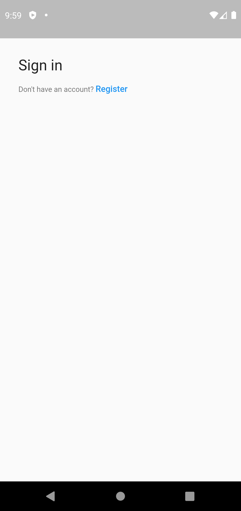

You'll also notice there is a "Register" handler, which when pressed will change the UI to a registration screen instead.
This is fully customizable and can be removed if required (more on customizing screens later).

Let's go ahead and add some providers!

## Adding Email & Password sign in

To allow the user to sign-in with an email and password, we first need to ensure that the Email/Password provider is enabled
in the [Firebase Console](https://console.firebase.google.com/project/_/authentication/providers):

<Image
  src="ui-email-provider.jpg"
  alt="Enable Email/Password Provider"
  caption={false}
/>

Next, add a new `EmailProviderConfiguration` instance to the `providerConfigs` list:

```dart
return SignInScreen(
  providerConfigs: [
    EmailProviderConfiguration(),
  ],
);
```

Just like that, we've now got a sign in screen which handles email and password authentication!

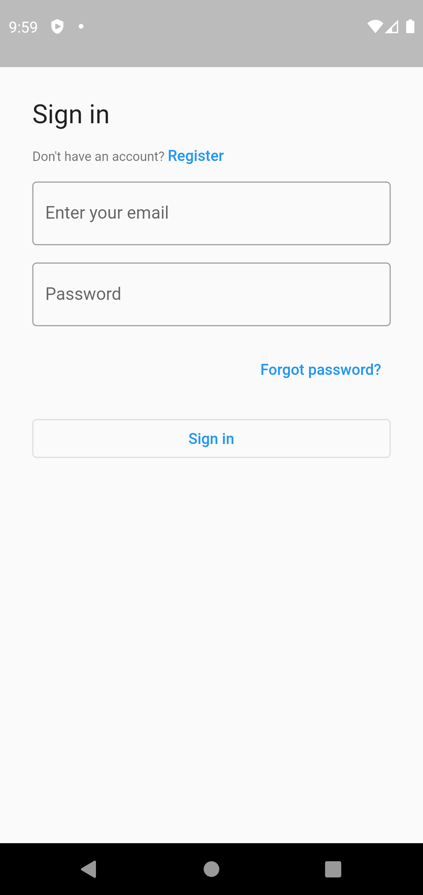

Behind the scenes, FlutterFire UI for auth will handle the entire sign-in process for us. Once signed in, the `StreamBuilder`
will be updated with the signed-in user and render our application. If the user signs out, the `SignInScreen` will be rendered.
Additionally, the UI handles various states such as the error messages (e.g. if an invalid email address is provided).

## Adding Google sign in

Commonly applications also provide support for authenticating with 3rd party providers, such as Google, Twitter, Facebook, Apple etc.
The widgets provided by the UI package allow us to configure these providers and render a themed button for each available provider.

To integrate Google as a provider, we first need to install the official [`google_sign_in`](https://pub.dev/packages/google_sign_in) plugin
which will handle the native authentication flow for us. For native mobile integration, you'll need to follow the steps as described in the
README of the `google_sign_in` plugin.

Additionally, ensure that the Google provider is enabled in the [Firebase Console](https://console.firebase.google.com/project/_/authentication/providers):

<Image
  src="ui-google-provider.jpg"
  alt="Enable Google Provider"
  caption={false}
/>

Next, add a new `GoogleProviderConfiguration` instance to the `providerConfigs` list:

```dart
return SignInScreen(
  providerConfigs: [
    EmailProviderConfiguration(),
    GoogleProviderConfiguration(
      clientId: '...',
    ),
  ],
);
```

For cross-platform compatibility, some providers require a few additional properties to be added to the configuration. In this case,
the `clientId` can be copied from the [Firebase Console](https://console.firebase.google.com/project/_/authentication/providers).

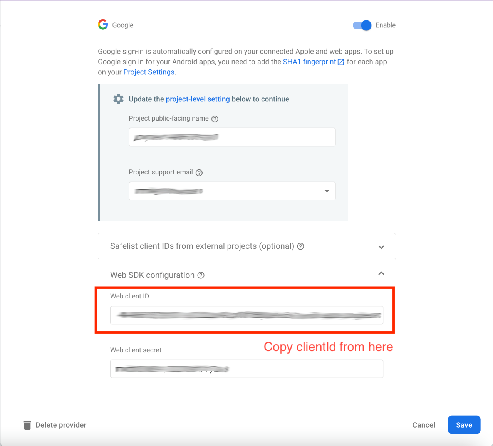

With the Google provider configuration added, our sign in screen will now include a Google button!

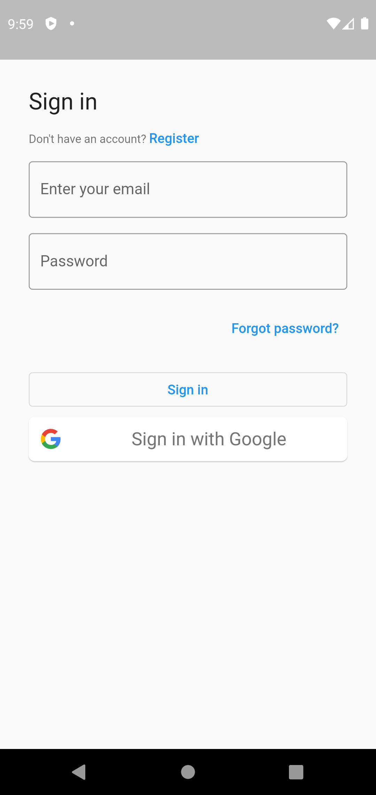

Just like Email/Password sign in, a successful Google sign-in will trigger the authentication listener allowing the user access to the application.

## Customizing the UI

The screens provided by the UI package are fairly basic on their own, however they are fully customizable,
allowing you to add images, alter text and more.

### Provider order

The order in which a provider is added to the `providerConfigs` list determines the order in which they'll appear within the screens.
For example, let's show the Google sign in button first:

```dart
return SignInScreen(
  providerConfigs: [
    GoogleProviderConfiguration(
      clientId: '...',
    ),
    EmailProviderConfiguration(),
  ],
);
```

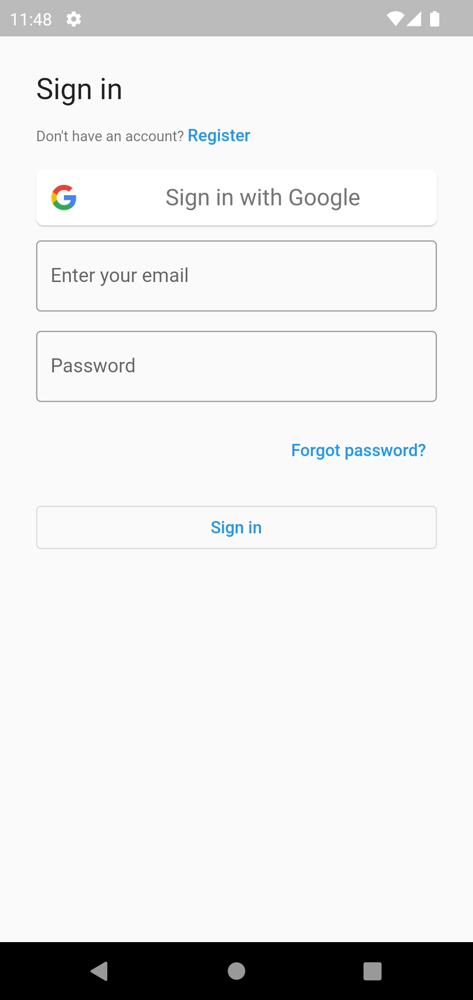

### Header content

Although functional, the sign in screen could do with a bit of styling. The `headerBuilder` property of screens
allows us to render a custom widget as a header, which will appear above our sign-in flow. For example, let's go ahead
and add an image to be shown above our sign-in flow:

```dart
return SignInScreen(
  headerBuilder: (context, constraints, _) {
    return Padding(
      padding: const EdgeInsets.all(20),
      child: AspectRatio(
        aspectRatio: 1,
        child: Image.network('https://firebase.flutter.dev/img/flutterfire_300x.png'),
      ),
    );
  },
  providerConfigs: [
    // ...
  ]
);
```

Great, our screen how has a nice header!

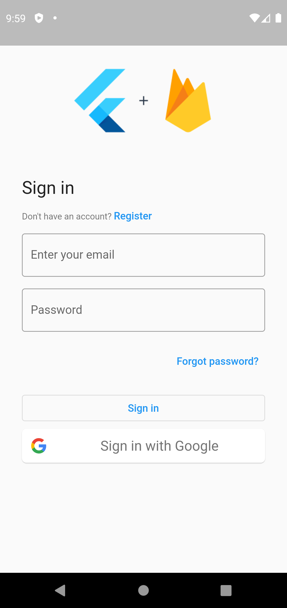

### Side content (desktop)

Although a header looks great on mobile devices, on desktop we still have a lot of unused horizontal space. Fortunately, screens
come with a `sideBuilder` property similar to `headerBuilder` which allows us to render a custom widget to the side of the screen.

Let's go ahead and add a custom image to the side of the screen which will be visible on larger screens:

```dart
return SignInScreen(
  sideBuilder: (context, constraints) {
    TODO add me
  },
  headerBuilder: (context, constraints, _) {
    // ...
  },
  providerConfigs: [
    // ...
  ]
);
```

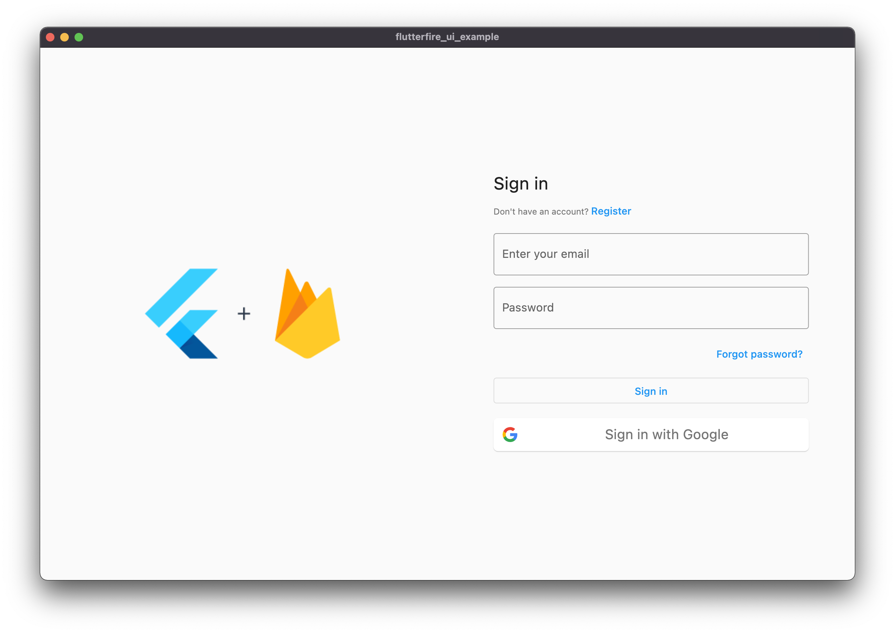

### Subtitle & footer content

Another common practice is to add some personalized text to the screen, such as instructions, terms and conditions,
privacy policy etc. The `subtitleBuilder` and `footerBuilder` properties allow us to render custom widgets to
the top and bottom of the screen:

```dart
return SignInScreen(
  subtitleBuilder: (context, action) {
    return Padding(
      padding: const EdgeInsets.only(bottom: 8),
      child: Text(
        action == AuthAction.signIn
            ? 'Welcome to FlutterFire UI! Please sign in to continue.'
            : 'Welcome to FlutterFire UI! Please create an account to continue',
      ),
    );
  },
  footerBuilder: (context, _) {
    return const Padding(
      padding: EdgeInsets.only(top: 16),
      child: Text(
        'By signing in, you agree to our terms and conditions.',
        style: TextStyle(color: Colors.grey),
      ),
    );
  },
  sideBuilder: (context, constraints) {
    // ...
  },
  headerBuilder: (context, constraints, _) {
    // ...
  },
  providerConfigs: [
    // ...
  ]
);
```

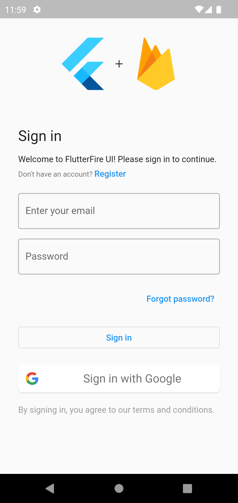

### Disabling internal navigation

Currently, our sign in screen allows the user to "navigate" to the register screen. In some cases you may want to disable this
and handle navigation yourself. Set the `showAuthActionSwitch` property to `false` to disable this behavior:

```dart
return SignInScreen(
  showAuthActionSwitch: false,
  // ...
);
```

## Additional screens

FlutterFire UI for Auth offers more than just a sign in screen - most common user scenarios are also available as screens. You'll find
that the API for screens is very similar to the API for sign in screens.

### Registration

A screen which allows the user to create an account.

```dart
return RegisterScreen(
  providerConfigs: [
    EmailProviderConfiguration(),
    GoogleProviderConfiguration(
      clientId: '...',
    ),
  ],
  // ...
);
```

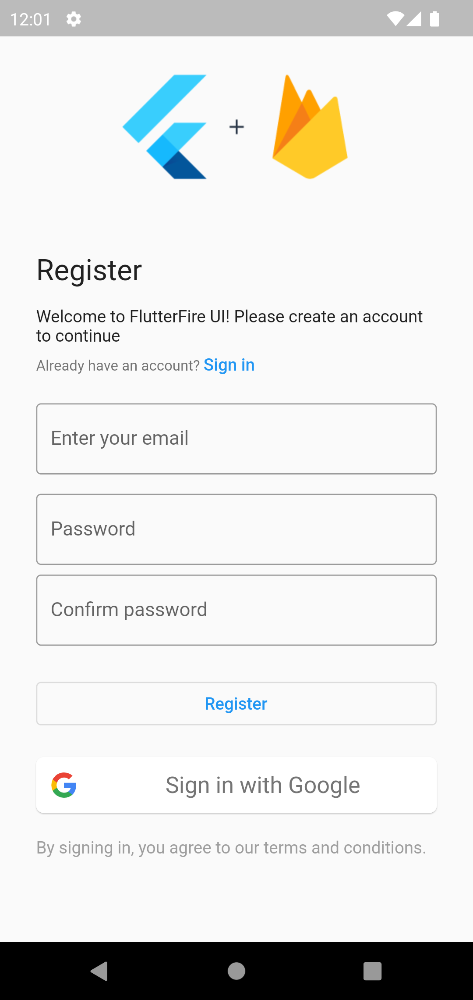

### Forgot Password

A screen which allows the user to enter their email address to send a password reset email.

```dart
return ForgotPasswordScreen(
  headerBuilder: (context, constraints, shrinkOffset) {
    return Padding(
      padding: const EdgeInsets.all(20).copyWith(top: 40),
      child: Icon(
        Icons.lock,
        color: Colors.blue,
        size: constraints.maxWidth / 4 * (1 - shrinkOffset),
      ),
    );
  },
);
```

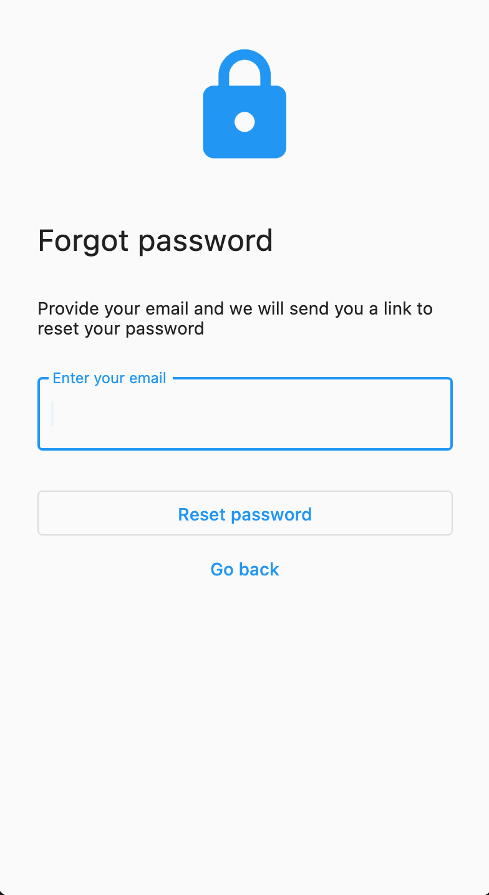

### Phone Number Authentication

A multi-flow screen which enables users to select a country code and provide their phone number.
Once provided, the user will be asked to verify the phone number via an SMS code.

```dart
return PhoneInputScreen(
  headerBuilder: (context, constraints, shrinkOffset) {
    return Padding(
      padding: const EdgeInsets.all(20).copyWith(top: 40),
      child: Icon(
        Icons.phone,
        color: Colors.blue,
        size: constraints.maxWidth / 4 * (1 - shrinkOffset),
      ),
    );
  },
);
```

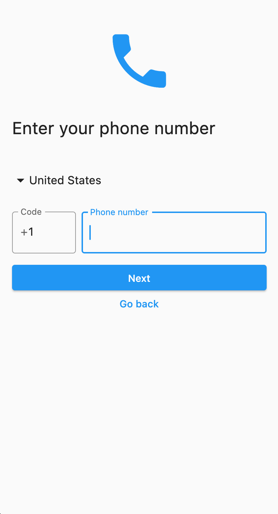

### Profile

When authenticated, displays a basic profile screen containing meta information such as their
avatar and editable profile data.

```dart
return ProfileScreen(
  providerConfigs: [
    EmailProviderConfiguration(),
    GoogleProviderConfiguration(
      clientId: '...',
    ),
    FacebookProviderConfiguration(
      clientId: '...',
    ),
    TwitterProviderConfiguration(
      clientId: '...',
    ),
    AppleProviderConfiguration(),
  ],
  avatarSize: 24,
);
```

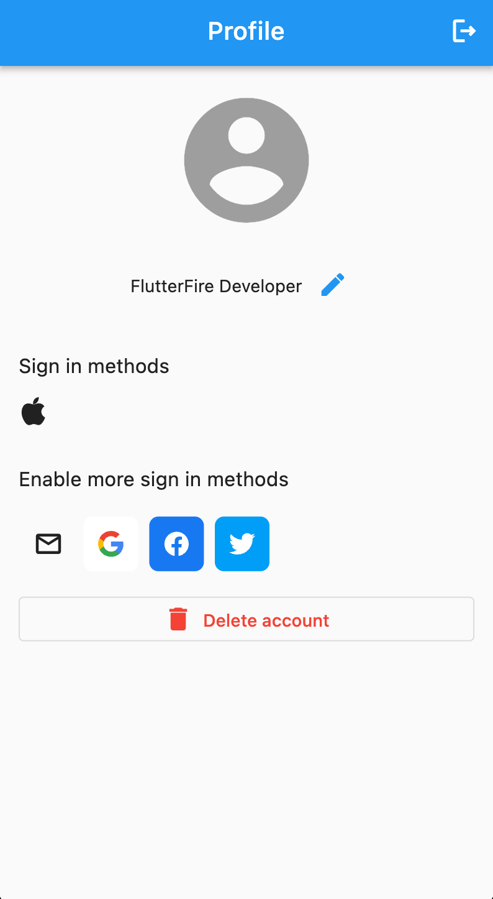

## Configuring auth providers globally

Instead of passing a list of providers to each screen, you can alternatively provide a list of provider configurations to the `FlutterFireUIAuth.configureProviders` method:

```dart
Future<void> main() async {
  // Firebase app should be initialized before calling configureProviders
  await Firebase.initializeApp();

  FlutterFireUIAuth.configureProviders([
    const EmailProviderConfiguration(),
    const PhoneProviderConfiguration(),
    const GoogleProviderConfiguration(clientId: GOOGLE_CLIENT_ID),
    const AppleProviderConfiguration(),
    const FacebookProviderConfiguration(clientId: FACEBOOK_CLIENT_ID),
    const TwitterProviderConfiguration(
      apiKey: TWITTER_API_KEY,
      apiSecretKey: TWITTER_API_SECRET_KEY,
      redirectUri: TWITTER_REDIRECT_URI,
    ),
  ]);

  runApp(MyApp());
}

class MyApp extends StatelessWidget {
  @override
  Widget build(BuildContext context) {
    final auth = FirebaseAuth.instance;

    return MaterialApp(
      initialRoute: auth.currentUser == null ? '/' : '/profile',
      routes: {
        '/': (context) {
          return SignInScreen(
            // no providerConfigs property - global configuration will be used instead
            actions: [
              AuthStateChangeAction<SignedIn>((context, state) {
                Navigator.pushReplacementNamed(context, '/profile');
              }),
            ],
          );
        },
        '/profile': (context) {
          return ProfileScreen(
            // no providerConfigs property here as well
            actions: [
              SignedOutAction((context) {
                Navigator.pushReplacementNamed(context, '/');
              }),
            ],
          );
        },
      },
    );
  }
}
```

## Next Steps

With your first screen integrated, you can now start adding more providers and integrating more screens!

- [Configuring Providers](configuring-providers)
- [Building a custom UI](building-a-custom-ui)
- [Localization](localization)
- [Theming](theming)
- [Navigation](navigation)
